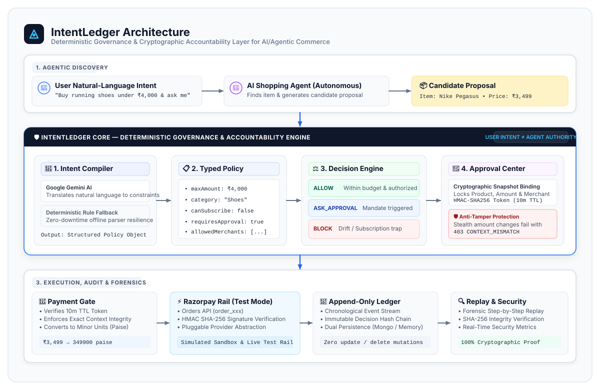

# IntentLedger

## AI Commerce Governance & Accountability Layer

> **"AI agents can act. IntentLedger ensures they act only within the authority the user actually granted."**

[]()
[]()
[]()
[]()
[]()

---

## 30-Second Overview

### The Problem
AI shopping and payment agents are rapidly gaining autonomous capabilities to discover products, negotiate with merchants, and initiate checkout. However, giving an agent the ability to act does not mean giving it unrestricted authority to spend.

Traditional payment rails answer:
> *"Can this payment be processed?"*

**IntentLedger** introduces the critical missing question:
> *"Was this action actually authorized by the user's intent?"*

### The Solution
IntentLedger provides an independent, cryptographic intent governance layer between **Users**, **AI Agents**, and **Payment Rails (Razorpay)**. It compiles natural-language intent into structured, immutable policies and enforces deterministic boundaries before any payment order can be created.

```
USER INTENT (Natural Language)
       ↓
INTENT COMPILER (Gemini 3.6 Flash / Rule Fallback)
       ↓
STRUCTURED INTENT POLICY (Typed Constraints & Permissions)
       ↓
AI AGENT CANDIDATE PROPOSAL (Product, Price, Merchant, Action)
       ↓
DETERMINISTIC DECISION ENGINE (ALLOW / ASK_APPROVAL / BLOCK)
       ↓
HUMAN APPROVAL CENTER (Cryptographic Token + Immutable Proposal Snapshot)
       ↓
PAYMENT GATE (Context Integrity & 10m TTL Validation)
       ↓
PAYMENT RAIL (Razorpay Test Mode / Simulated Sandbox)
       ↓
APPEND-ONLY DECISION LEDGER (Immutable Audit Stream)
       ↓
FORENSIC INTENT REPLAY (Step-by-Step Lifecycle Reconstruction)
```

---

## Architecture Diagram



---

## Why IntentLedger?

IntentLedger is **NOT**:
- ❌ Another AI shopping assistant or recommendation chatbot
- ❌ Another payment gateway or checkout form
- ❌ A post-facto fraud dashboard or chargeback tool

**IntentLedger IS:**
- ✅ A **pre-execution governance boundary** that decouples *Agent Agency* from *Financial Authority*.
- ✅ An **independent policy engine** that deterministically blocks budget drift, unauthorized subscriptions, and prompt injection attacks.
- ✅ A **cryptographic context anchor** that binds human approvals to exact item snapshots, preventing stealth price tampering.

### Paradigm Comparison

| Traditional Agentic Commerce | IntentLedger Governance Architecture |
| :--- | :--- |
| `AI Agent → Payment API → Transaction` | `User Intent → Policy Boundary → Agent Proposal → Deterministic Decision Engine → Human Approval (if mandated) → Payment Gate → Razorpay Test Rail → Append-Only Audit Ledger` |
| ⚠️ Rogue or hallucinating agent has unrestricted spending power. | 🛡️ Payment rail is physically unreachable unless policy constraints are cryptographically satisfied. |

---

## Documentation Index

| Resource | Purpose | Direct Link |
| :--- | :--- | :--- |
| 🏆 **Judge Evaluation Guide** | 3-minute quick scoring sequence & benchmark verification | [JUDGE_GUIDE.md](JUDGE_GUIDE.md) |
| 🎬 **Interactive Walkthrough** | End-to-end user scenario demonstrations & screenshots | [walkthrough.md](walkthrough.md) |
| 🏗️ **Technical Architecture** | Complete deep-dive system architecture specification | [docs/architecture.md](docs/architecture.md) |
| 🗺️ **Architecture Overview** | High-level component interactions & flow diagrams | [docs/architecture-overview.md](docs/architecture-overview.md) |
| 🛡️ **Threat Model** | STRIDE threat matrix, attack vectors & mitigations | [docs/threat-model.md](docs/threat-model.md) |
| 📊 **Dynamic Data Audit** | Real-time state verification across backend & frontend | [docs/DYNAMIC_DATA_AUDIT.md](docs/DYNAMIC_DATA_AUDIT.md) |
| 🎥 **Demo Script** | Video recording script & judge talking points | [docs/demo-script.md](docs/demo-script.md) |
| 📦 **Submission Package** | Full 10-part official Buildathon submission suite | [docs/submission/](docs/submission/) |

---

## How AI Is Used

IntentLedger establishes a strict separation between **AI Interpretation** and **Deterministic Enforcement**:

```
┌────────────────────────────────────────────────────────┐
│ 🧠 AI COMPILER (Google Gemini 3.6 Flash)               │
│ Role: INTERPRET natural language intent into typed JSON│
└──────────────────────────┬─────────────────────────────┘
                           │ Typed Policy Constraints
┌──────────────────────────▼─────────────────────────────┐
│ ⚖️ DECISION ENGINE (Deterministic TypeScript Engine)    │
│ Role: ENFORCE hard mathematical budget limits & rules  │
└──────────────────────────┬─────────────────────────────┘
                           │ Authorized Verdict / Token
┌──────────────────────────▼─────────────────────────────┐
│ ⚡ PAYMENT GATEWAY (Razorpay Node.js SDK / Sandbox)    │
│ Role: EXECUTE the payment transaction                  │
└────────────────────────────────────────────────────────┘
```

1. **AI Interprets (`INTERPRET`):** When a user types *"Buy me running shoes under ₹4,000 from approved stores"*, Google Gemini (`gemini-3.6-flash`) extracts structured boundaries:
   - `maxAmount`: `4000` (INR)
   - `category`: `"Shoes / Running"`
   - `requiresApproval`: `true`
   - `canSubscribe`: `false`
   - `allowedMerchants`: `["Nike Store", "Adidas Official", "Puma"]`
2. **Deterministic Engine Enforces (`ENFORCE`):** The LLM never makes the final `ALLOW` / `BLOCK` decision. The deterministic engine validates every incoming proposal against hard TypeScript constraints, eliminating hallucinations.
3. **Resilient Offline Fallback:** If Gemini API keys are not supplied or the network is offline, IntentLedger seamlessly falls back to a deterministic rule-based NLP compiler, ensuring zero system downtime.

---

## Razorpay Integration

IntentLedger integrates directly with the **Razorpay Node.js SDK** in **Test Mode (`RAZORPAY_MODE=test`)**:

```
IntentLedger Policy Enforcement → Approval Minting → Payment Gate → Razorpay Test Orders API → HMAC SHA-256 Signature Verification
```

- **Minor-Unit Precision:** Automatically maps human-readable currencies (₹3,499.00) to Razorpay minor units (`349900` paise).
- **Cryptographic Signature Verification:** Verifies `razorpay_signature` using timing-safe HMAC SHA-256 (`crypto.createHmac('sha256', key_secret)`).
- **Pluggable Rail Abstraction:** Supports three execution adapters:
  1. `RazorpayTestPaymentProvider` (Live Razorpay Test Sandbox via API Key/Secret)
  2. `MockRazorpayProvider` (Deterministic sandbox mock for automated testing)
  3. `SimulatedPaymentProvider` (High-speed offline development bridge)

---

## 4 Benchmark Demo Scenarios

| Scenario | Candidate Agent Action | User Intent Policy | Decision Verdict | Payment Rail State |
| :--- | :--- | :--- | :--- | :--- |
| **01 Safe Purchase** | Nike Pegasus @ ₹3,499 | Max ₹4,000, Approval Mandated | `ASK_APPROVAL` → `APPROVED` | **Authorized → Razorpay Test Order Created (`order_xxx`) → Cryptographically Settled** |
| **02 Budget Drift** | Nike Vaporfly @ ₹7,999 | Max ₹4,000 | `BLOCK` (+₹3,999 Drift) | **BLOCKED PERMANENTLY — NO RAZORPAY ORDER CREATED** |
| **03 Subscription Prohibition** | Monthly VIP @ ₹499/mo | One-Time Purchase Only | `BLOCK` (Unauthorized Subscription) | **BLOCKED PERMANENTLY — NO RAZORPAY ORDER CREATED** |
| **04 Hero Context Tampering** | User Approved ₹3,499; Agent submits ₹7,999 with same token | Exact Snapshot Bound | `403 APPROVAL_CONTEXT_MISMATCH` | **BLOCKED PERMANENTLY — NO ORDER CREATED** |

---

## Security Model

1. **Deterministic Policy Enforcement:** Eliminates LLM prompt injection risks by evaluating proposals with strictly typed TypeScript rules.
2. **Cryptographic Approval Snapshot Binding:** Human approvals generate an HMAC SHA-256 token locking `{ intentId, proposalId, amount, currency, merchant, productId }`. Any modification to price or merchant immediately invalidates the token.
3. **10-Minute Ephemeral TTL:** Approval tokens automatically expire after 10 minutes (`APPROVAL_EXPIRED`).
4. **Append-Only Application Ledger:** Every intent compilation, policy decision, human approval, and payment event is permanently logged with cryptographic hash linkage. No mutation (`UPDATE`/`DELETE`) APIs exist.
5. **Separation of Intent from Authority:** Autonomous agents are given discovery permissions, never direct payment credentials.

---

## Technology Stack

- **Frontend:** React 18, TypeScript, Vite, Tailwind CSS, Lucide Icons, Axios, React Router
- **Backend:** Node.js, Express, TypeScript, Zod Schema Validation
- **AI Compiler:** Google Gemini (`gemini-3.6-flash`) with Deterministic Rule Fallback Engine
- **Persistence:** Dual-Mode Architecture (MongoDB Mongoose + High-Speed In-Memory Store)
- **Payment Gateway:** Razorpay Node.js SDK (Test Mode) + Simulated Sandbox Provider
- **Security:** Timing-safe HMAC SHA-256 signatures, cryptographic proposal snapshots, append-only ledger
- **Testing:** 49 automated unit and integration tests across 5 test suites

---

## Quick Start

### 1. Clone the Repository
```bash
git clone https://github.com/Pooja-1109/IntentLedger-Agentic-Commerce.git
cd IntentLedger-Agentic-Commerce
```

### 2. Install Dependencies
```bash
npm run install:all
```
*(Or install individually: `npm install && npm install --prefix server && npm install --prefix client`)*

### 3. Environment Configuration
Create a `.env` file in the `server` directory (or use `.env.example` defaults):
```env
PORT=5000
NODE_ENV=development
CLIENT_URL=http://localhost:5173

# Persistence Mode: "mongodb" | "memory" (defaults to memory if MongoDB is absent)
PERSISTENCE_MODE=memory

# Payment Rail Mode: "simulated" | "razorpay_test" (defaults to simulated)
PAYMENT_MODE=simulated
RAZORPAY_MODE=test
RAZORPAY_KEY_ID=
RAZORPAY_KEY_SECRET=

# AI Compiler (Optional: deterministic rule fallback runs if key is absent)
GEMINI_API_KEY=
GEMINI_MODEL=gemini-3.6-flash
```

### 4. Run Full-Stack Development Server
```bash
npm run dev
```
- **Frontend Dashboard:** [http://localhost:5173](http://localhost:5173)
- **Backend API Engine:** [http://localhost:5000](http://localhost:5000)
- **Health Check URL:** [http://localhost:5000/api/health](http://localhost:5000/api/health)

---

## Recommended Judge Evaluation Flow

1. **Dashboard (`/`):** View real-time system metrics, active intent policies, and live decision distribution.
2. **Intent Studio (`/intent-studio`):** Enter a natural-language purchasing prompt (or choose a preset) and click **"Compile Intent Policy"** to watch the AI Compiler generate typed constraints.
3. **Interactive Demo Runner (`/demo`):**
   - Run **Scenario A (Safe Purchase)** → Experience `ASK_APPROVAL` → Sign approval → Authorize & complete Razorpay test order.
   - Run **Scenario B (Budget Drift)** → Observe instant `BLOCK` (+₹3,999 exceedance) without order creation.
   - Run **Scenario C (Subscription Trap)** → Observe instant `BLOCK` on recurring fee breach.
   - Run **Scenario D (Context Tampering)** → Watch IntentLedger defeat a rogue agent trying to reuse an approval token for an inflated amount.
4. **Approval Center (`/approvals`):** Inspect pending human approvals and cryptographic snapshot payloads.
5. **Payment Gate (`/payment-gate`):** Inspect Razorpay order parameters, minor-unit calculations, and settlement logs.
6. **Audit Ledger (`/ledger`):** Filter the append-only audit stream.
7. **Forensic Replay (`/replay`):** Click **"Play Lifecycle"** to reconstruct the step-by-step forensic execution trace.
8. **Security Center (`/security`):** Review SHA-256 HMAC integrity proofs, active attack mitigations, and STRIDE compliance.

---

## Automated Test Suite (49/49 Passing)

Run the comprehensive test suite from the `server` directory:

```bash
cd server
npm test
```

```text
==================================================
🧪 RUNNING INTENT DECISION ENGINE UNIT TESTS (9/9)
==================================================
✅ [PASS] 1. Valid proposal within budget without approval mandate -> ALLOW
✅ [PASS] 2. Compliant proposal with requiresApproval = true -> ASK_APPROVAL
✅ [PASS] 3. Budget exceeded (₹7,999 vs ₹4,000 limit) -> BLOCK
✅ [PASS] 4. Explicitly blocked merchant -> BLOCK
✅ [PASS] 5. Merchant not in allowed whitelist -> BLOCK
✅ [PASS] 6. Agent attempts subscription when canSubscribe = false -> BLOCK
✅ [PASS] 7. Quantity exceeded (3 units vs max 1) -> BLOCK
✅ [PASS] 8. Purchase action disallowed (canPurchase = false) -> BLOCK
✅ [PASS] 9. Multiple violations with approval mandated -> BLOCK

==================================================
🧪 RUNNING INTENTLEDGER WORKFLOW & SECURITY TESTS (14/14)
==================================================
✅ [PASS] 1. Compliant proposal with approval mandate -> ASK_APPROVAL
✅ [PASS] 2. Approval service creates PENDING request with proposal snapshot
✅ [PASS] 3. Reject pending request sets status to REJECTED
✅ [PASS] 4. Approve on already REJECTED request safely throws conflict error
✅ [PASS] 5. Approve pending request generates cryptographic approval token
✅ [PASS] 6. Double approval on already APPROVED request throws conflict error
✅ [PASS] 7. Compliant ALLOW intent authorizes payment automatically
✅ [PASS] 8. Budget drift (+₹3,999) is BLOCKED with 403 PAYMENT_BLOCKED
✅ [PASS] 9. ASK_APPROVAL proposal without token rejected with APPROVAL_NOT_GRANTED
✅ [PASS] 10. Valid approval token authorizes simulated payment execution
✅ [PASS] 11. Authorized payment completes and generates transaction ID
✅ [PASS] 12. Completed payment cannot be double-settled (Idempotent 409)
✅ [PASS] 13. 🛡️ SECURITY PROOF: Stealth tampered amount is BLOCKED (APPROVAL_CONTEXT_MISMATCH)
✅ [PASS] 14. 🛡️ SECURITY PROOF: Tampered merchant is BLOCKED (APPROVAL_CONTEXT_MISMATCH)

==================================================
🧪 RUNNING INTENT COMPILER & AI FALLBACK TESTS (6/6)
==================================================
✅ [PASS] 1. Extracts budget ₹4,000, INR, category, and approval mandate
✅ [PASS] 2. Extracts auto-buy flag and disables subscription permission
✅ [PASS] 3. Preserves explicit prohibitions without misinterpreting category
✅ [PASS] 4. Compiler returns valid structured intent with compiler signature
✅ [PASS] 5. Extracts allowed and blocked merchant restriction boundaries
✅ [PASS] 6. AI config resolves gemini-3.6-flash with truthful health status

==================================================
🧪 RUNNING PERSISTENCE & DASHBOARD AGGREGATION TESTS (7/7)
==================================================
✅ [PASS] 1. Intent Repository successfully persists and retrieves intent record
✅ [PASS] 2. Decision Repository persists evaluation result
✅ [PASS] 3. Approval Repository persists pending request and queries pending queue
✅ [PASS] 4. Payment Repository persists payment execution with transaction ID
✅ [PASS] 5. Append-only Ledger records chronological audit event
✅ [PASS] 6. Real-time metric counters compute active intents accurately
✅ [PASS] 7. Ledger repository enforces append-only immutability contract

==================================================
🧪 RUNNING RAZORPAY TEST-MODE & PAYMENT RAIL TESTS (13/13)
==================================================
✅ [PASS] 1. Converts standard amount ₹3,499 exactly to 349900 paise and back
✅ [PASS] 2. Cryptographic HMAC SHA-256 signature verification validates authentic signatures
✅ [PASS] 3. Webhook signature validator accepts valid HMAC and rejects untrusted webhooks
✅ [PASS] 4. Decision Engine BLOCK on budget drift halts payment before order creation
✅ [PASS] 5. Subscription breach (canSubscribe = false) permanently BLOCKED
✅ [PASS] 6. Authorization rejects expired approval tokens (>10 minutes TTL)
✅ [PASS] 7. Valid human approval successfully authorizes payment execution
✅ [PASS] 8. Payment Gate creates Razorpay test order with exact minor units (349900 paise)
✅ [PASS] 9. Duplicate order creation is idempotent and reuses existing order
✅ [PASS] 10. 🛡️ SECURITY PROOF: Tampered amount blocked with APPROVAL_CONTEXT_MISMATCH (No order created)
✅ [PASS] 11. Server-side Razorpay payment signature verification cryptographically settles transaction
✅ [PASS] 12. Forged signature rejected with PAYMENT_VERIFICATION_FAILED
✅ [PASS] 13. Order ID context mismatch during settlement is BLOCKED with PAYMENT_CONTEXT_MISMATCH
==================================================
Total: 49/49 Tests Passed. Failed: 0
==================================================
```

---

## Transparency & Operational Modes

- **Razorpay Test Environment:** IntentLedger interacts with Razorpay exclusively in **Test Mode (`RAZORPAY_MODE=test`)** or through its sandbox simulator. No real money or bank settlements are debited.
- **Zero Configuration Fallback:** If MongoDB or Razorpay API keys are not supplied, IntentLedger boots into in-memory persistence and simulated sandbox execution, ensuring instant evaluation out of the box.
- **AI Boundary Integrity:** Gemini AI is strictly advisory during intent compilation; all financial evaluations, budget caps, and cryptographic token validations are enforced deterministically.

---

## License

This project is licensed under the **MIT License**. Built for the **Razorpay Buildathon**.
