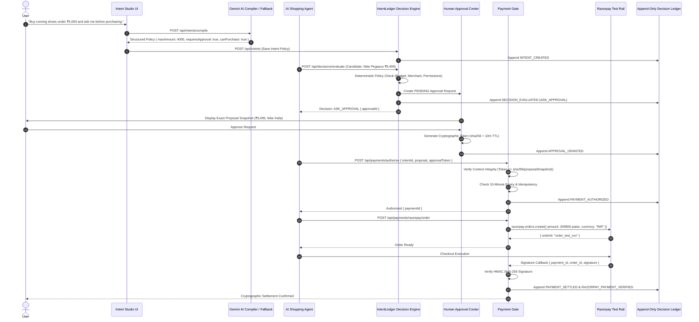

# IntentLedger — Complete Architecture & Sequence Specification

---

## Architecture Boundaries

1. **Advisory AI Boundary:**
   - Gemini models extract natural-language intent into a structured JSON schema.
   - The LLM has **zero** permission to execute payments or override constraints.

2. **Deterministic Enforcement Boundary:**
   - The Decision Engine enforces mathematical invariants (`amount <= maxAmount`, `merchant in allowedMerchants`, `isSubscription <= canSubscribe`).
   - Rejects violations with explicit drift metrics.

3. **Cryptographic Context Binding:**
   - Approval tokens are mathematically bound to the immutable `proposalSnapshot`.
   - Any alteration of amount, merchant, or product triggers `403 APPROVAL_CONTEXT_MISMATCH`.

4. **Downstream Payment Rails:**
   - Orders are created via Razorpay Test Mode SDK only after policy authorization passes.
   - Forged payment responses or tampered amounts are rejected server-side via timing-safe HMAC SHA-256 verification.
